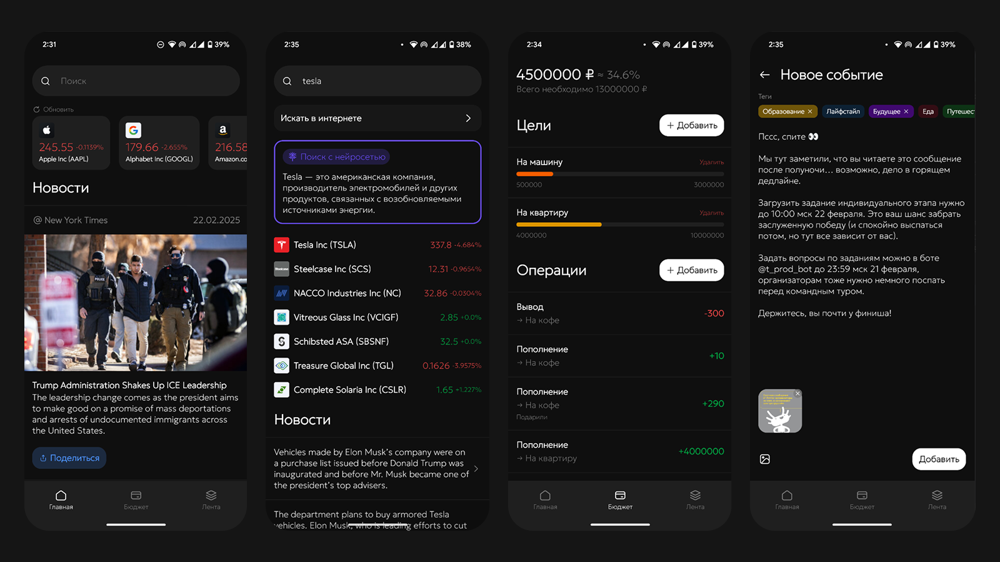

# SuperFinancer



**⚠️ Этот проект - решение индивидуального тура заключительного этапа олимпиады PROD.** Для удобства тестирования экспертами некоторые ключи от внешних сервисов были вынесены в отдельный синглтон. Как избежать проблем при сборке описано ниже.

**SuperFinancer** – это приложение для тех, кто интересуется деньгами и всем, что с этим связано. Приложение представляет из себя менеджер финансов с аггрегатором полезной информации, а именно отслеживание фондового рынка и новостного фона в экономике. Для наших клиентов важно не только отслеживать, но и делиться. Поэтому рядом с функционалом "дневника и справочника финансов" живет и отдельная новая социальная сеть. Представьте, как может быть круто, когда можно поделитсья своими находками или наблюдениями и научить других также здорово подходить к финансам. SuperFinancer нацелен помочь в управлении своими финансами и быть макисмально экономически продуктивынм.

## Про проект

- Минимальное SDK - 26(Android 8)
- Разрабатывается в Android Studio 2024.1.1 Koala
- Стек - Kotlin, Jetpack Compose
- Архитектура - MVVM 

## Документация и ресурсы

- [Документация проекта](https://kmustafin.yonote.ru/share/b7ddfcc0-7d4e-4036-877f-7f1eba46446e/doc/dokumentaciya-mTv9JGSMJ4)
- [ADR (обоснование принятых решений)](https://kmustafin.yonote.ru/share/8462d4e1-11cd-4a8a-acbe-e2621ec1fed9/doc/adr-4NCBHPUJsG)
- [Справка для проверяющего](https://kmustafin.yonote.ru/share/30337425-3606-487a-b37d-f517c809aaed/doc/pamyatka-dlya-proveryayushih-dgcvbwmykk)

## Сборка проекта

Перед сборкой необходимо создать объекты(Keys.kt) с ключами от различных внешних сервисов:

**В корне модуля network:**

```kt
object Keys {
    const val NY_TIMES_API_KEY = "YOUR_KEY" // https://developer.nytimes.com/
    const val FINNHUB_API_KEY = "YOUR_KEY" // https://finnhub.io/
    const val YANDEX_CLOUD_API_KEY = "YOUR_KEY" // https://yandex.cloud/
}
```

**В корне модуля analytics:**

```kt
object Keys {
    const val APP_METRICA_KEY = "YOUR_KEY" // https://appmetrica.yandex.ru
}
```